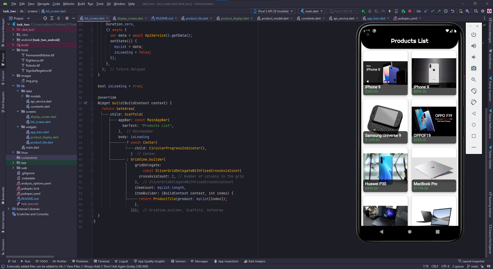

# ICTHUB Flutter Task Two

A flutter project created as a task for the ICTHUB Flutter Course

## Task Details

### *[ Task 3 ]*

Part one of task three is to create a gridview of products fetched from a database using API and http dependency and display them to the user.

Part two of the task is to create a display screen that displays all the information about a specific product when tapped on it.

The color scheme of the app has a black theme shown in the Appbar, Products list and the Product Display screen.

**Task three Screenshots**

---

***Task Created by: Adham Elshabasy***